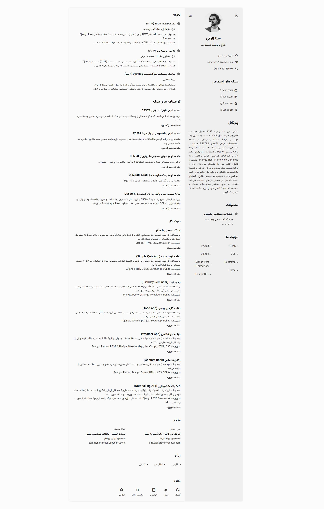
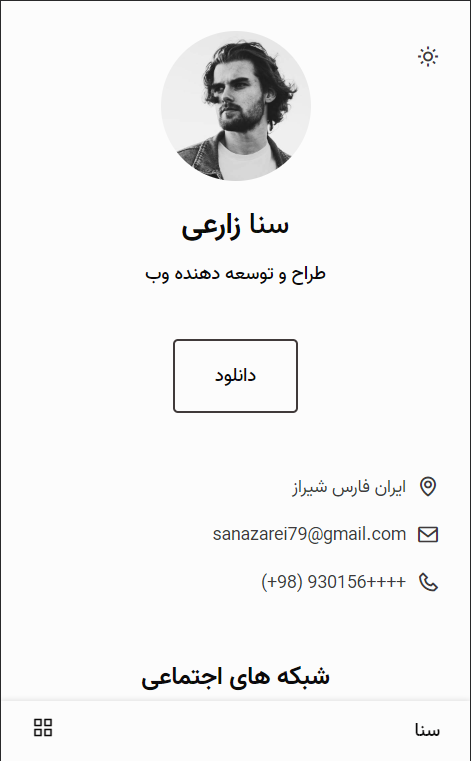
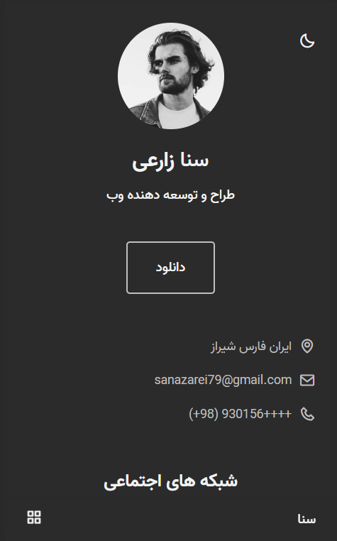

# رزومه پاسخگو سانا زارعی
### رزومه پاسخگو و وبسایت CV با استفاده از HTML، CSS و جاوا اسکریپت

- دارای ناوبری موبایل با آیکون‌ها
- اسکرول روان در هر بخش در نسخه موبایل
- شامل تم روشن و تاریک
- قابلیت صادر کردن وبسایت رزومه به PDF
  
 **لیست کارهای قابل انجام:**

<ul style="list-style-type:none; direction: rtl;">
    <li><input type="checkbox" checked disabled> - [x] انتشار نسخه اولیه وبسایت </li>
    <li><input type="checkbox" checked> - [ ] رفع مشکل صادر کردن PDF </li>
    <li><input type="checkbox" checked> - [ ] بهینه‌سازی برای SEO </li>
    <li><input type="checkbox" checked> - [ ] بهینه‌سازی عملکرد </li>
    <li><input type="checkbox" checked> - [ ] به‌روزرسانی مداوم محتوا </li>
</ul>

  <strong>حالت دسکتاپ + تم روشن</strong>

  

  <strong>حالت موبایل + تم روشن</strong>

  

  <strong>حالت موبایل + تم تاریک</strong>

  

